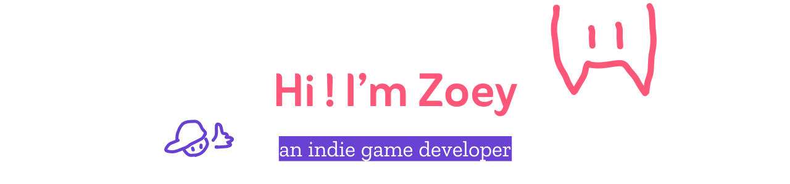

    
   

I make games and draw cool pictures. <a href="https://yiczy2233.github.io">Click here to my website.</a>

### About me
💼 **Game Maker:** I use Unity to build my own games.

🌱 **Learning:** I am learning how to build websites with JavaScript

🎨 **Artist:** I love drawing and designing worlds for games.

💬 **Ask me about:** C#, drawing, or how to make games.

✨ **My Goal:** To make things that look beautiful and work perfectly.

---

### 🛠 Tech Stack

#### 🕹 Engines & Software

      

#### 🌐 Languages

     

---
